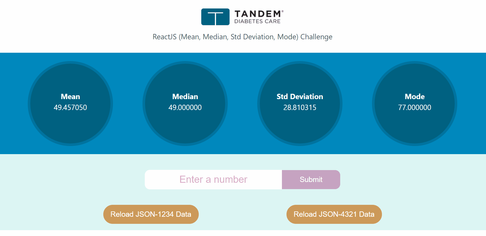
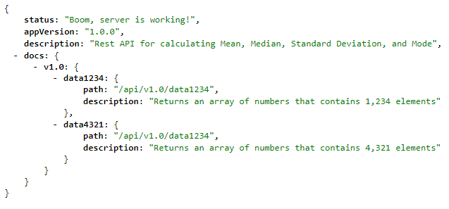
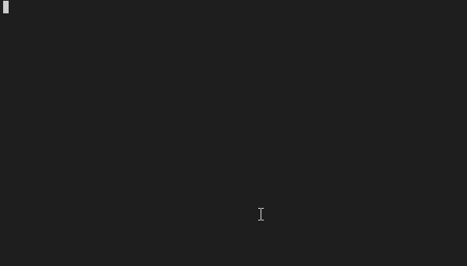
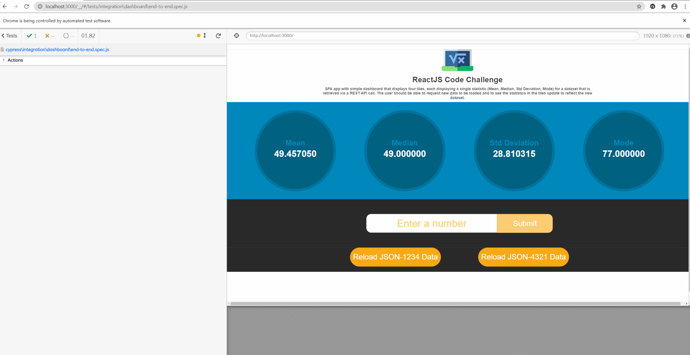

# ReactJS Coding Challenge



[View the demo here](https://stats-challenge-in-react-js.herokuapp.com/)

## Objective

Develop a Single Page App (SPA) that shows a simple dashboard that displays four tiles, each displaying a single statistic for a dataset that is retrieved via a REST API call. The user should be able to request new data to be loaded and to see the statistics in the tiles update to reflect the new dataset.

## Requirements

1. The app shall be implemented using ReactJS components and developed using either JavaScript or TypeScript, with the latter preferred.
2. The app shall display four statistics tiles: Mean, Median, Standard Deviation, and Mode.
3. The app shall present a button which, when clicked, will cause a new dataset to be loaded(replacing the current dataset)and the dashboard display to be updated to reflect the newly loaded data.
4. The app shall present an inputfield that will accept a number and a submit button which, when clicked, will cause the number to be addedto the currently loaded datasetand the dashboard tiles to update to reflect the new dataset state.

## Dashboard Tiles

1. Mean - [https://en.wikipedia.org/wiki/Arithmetic_mean](https://en.wikipedia.org/wiki/Arithmetic_mean 'Mean')
2. Median – [https://en.wikipedia.org/wiki/Median](https://en.wikipedia.org/wiki/Median 'Median')
3. Standard Deviation – [https://en.wikipedia.org/wiki/Standard_deviation](https://en.wikipedia.org/wiki/Standard_deviation 'Standard Deviation')
4. Mode – [https://en.wikipedia.org/wiki/Mode\_(statistics)](<https://en.wikipedia.org/wiki/Mode_(statistics)> 'Mode')

## Expected Results

### data-1234.json

| Tile       |  Default  | After adding 42 |
| :--------- | :-------: | --------------: |
| **Mean**   | 49.457050 |       49.451012 |
| **Median** | 49.000000 |       49.000000 |
| **StdDev** | 28.810315 |       28.799421 |
| **Mode**   | 77.000000 |       77.000000 |

### data-4321.json

| Tile       |  Default  | After adding 42 |
| :--------- | :-------: | --------------: |
| **Mean**   | 50.346679 |       50.344748 |
| **Median** | 51.000000 |       51.000000 |
| **StdDev** | 29.191159 |       29.188057 |
| **Mode**   | 82.000000 |       82.000000 |

## Tech Stack

### Client Stack

- ReactJS (Javascript)
- React Hooks
- Custom React Hooks
- Styled Components
- Framer Motion
- Unit Tests
  - Jest
  - React Testing Library
- End to End Tests
  - Cypress

### Server Stack (For Rest API Calls)

- Node
- Express
- Javascript

### Build/Deployment

- Heroku

## 🚀 Quick start

## Scripts

### `git clone`

```shell
   # clone this project. If you are forking it first, make sure to use your
   # own github username in place of mine ;)
   git clone https://github.com/briang123/reactjs-stats-code-challenge.git
```

### `npm install`

Once you clone the project, you will want to make sure you install all dependencies to get up and running.

```shell
  npm install
```

### `npm run start`

This command runs both the server and the client concurrently in development mode. The server is listening on [http://localhost:5000](http://localhost:5000) (Note: You will not be able to pull this up in a web browser directly) and the React app runs on [http://localhost:3000](http://localhost:3000)

If you want to run the code as-if you're in production, then update the local .env file with `NODE_ENV=production`

```shell
  npm run start
```

### `npm run server`

Open [http://localhost:5000/connection](http://localhost:5000/connection) in a web browser to test your Rest API. The connection endpoint (http://localhost:5000/connection) will show you some brief documentation and version information for the endpoints.



```shell
  npm run server
```

### `npm run test`

Launches the test runner in the interactive watch mode. See the section about [running tests](https://facebook.github.io/create-react-app/docs/running-tests) for more information.

```shell
  npm run test
```

### `npm run cypress`

Launches the Cypress test runner in the interactive mode.

```shell
  npm run cypress
```

### `npm run cypress:e2e`

Ensure that the React app is running on [http://localhost:3000](http://localhost:3000) before running this command as Cypress will attempt to access it to do its thing. This command will run the test I created this and output to the terminal.

```shell
  npm run cypress:e2e
```

### `npm run build`

Before deploying to your own server, make sure to build a production version of your application.

```shell
  npm run build
```

## Deploying to Heroku

Make sure to download and install the [Heroku CLI](https://devcenter.heroku.com/articles/heroku-cli#download-and-install]) and create an account for yourself.

We are using the Heroku Buildpack for create-react-app. More information on that can be found at [https://github.com/mars/create-react-app-buildpack](https://github.com/mars/create-react-app-buildpack)

Before executing the steps below, make sure you do a `git commit` on your code changes and that you have built your project using `npm run build`.

```shell
cd $APP_NAME
heroku create $APP_NAME --buildpack mars/create-react-app
git push heroku master
heroku open
```

## 🧐 What's inside?

A quick look at the top level directories you'll see in this project.

    .
    ├── cypress
    ├──── integration
    ├────── dashboard
    ├── public
    ├── server
    ├──── controllers
    ├──── db
    ├──── routes
    ├──── services
    ├──── utils
    ├──── index.js
    ├── src
    ├──── __tests__
    ├──── common
    ├──── components
    ├──── docs
    ├──── hooks
    └──── theme

`cypress` - In the **cypress > integration > dashboard** directory, I created end-to-end tests for this project

`public` - React will build and deploy to this folder while in development

`server` - In lieu of creating a separate Node.js server to that provides the Rest API for this challenge, I took the direction of creating a Node.js server proxy to simplify and expedite the process. If you would like to learn more about this you can [read this article](https://www.twilio.com/blog/react-app-with-node-js-server-proxy).

For the project folder on the server, I structured it so that there is a clear separation of concerns/layers in the application. Basically, we have our `routes`, which forward requests to our `controllers` (handles requests), which make calls to the `services` layer (business logic), which make calls to the `db` where methods are created that make calls to the database or external API's. There is also a separate utils directory that contains any common/shared functionality.

`src` - This is the React app that will make the Rest API requests to the server via a custom React hook (**useDataFetch**) to obtain the dataset needed to calculate the statistical data to display on the dashboard.

I created a few additional React hooks to help with this task (**useStatistics** and **useNumArray**). The implementation details for the calcuations exist in the **NumArray** class, which are called directly from **calculateMedian**, **calculateMean**, **calculateStdDeviation**, and **calculateMode**.

Our components are structured so that there is a separation of concerns, as well, but there is room for additional separation.

`App` - Container for the **Header** and **Body** components

`Body` - Container for the **Dashboard**, **Form**, and **DataReload** components.

`Header` - Container for the logo, title, and description

`Dashboard` - Container for the **Tile** component where there is one for each statistic.

`Form` - Container for the input (**NumberInput** component and **useNumberInput** custom React hook) and submit button (**Button**).

`DataReload` - Container for the two buttons (**Button**) that, when clicked, will trigger a Rest API call to the server to get the data.

I'm leveraging `Styled Components` and, at times, co-mingling with `Framer Motion` to bring the animation you will see. For CSS, I took a very basic mobile-first approach to the layout where I only have a couple breakpoints to change the styles, but using Flexbox to style the page.

## Testing

### Unit Tests (Jest, React Testing Library)



### End to End Tests (Cypress)


